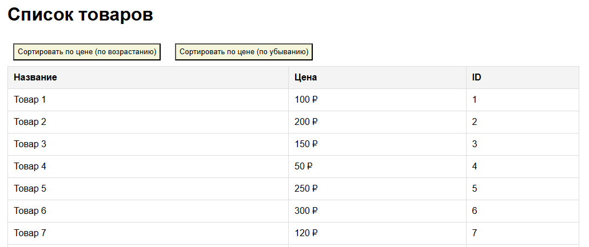
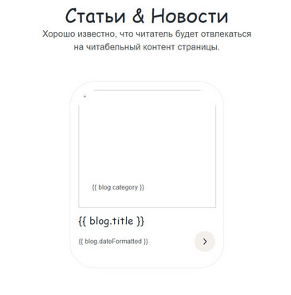
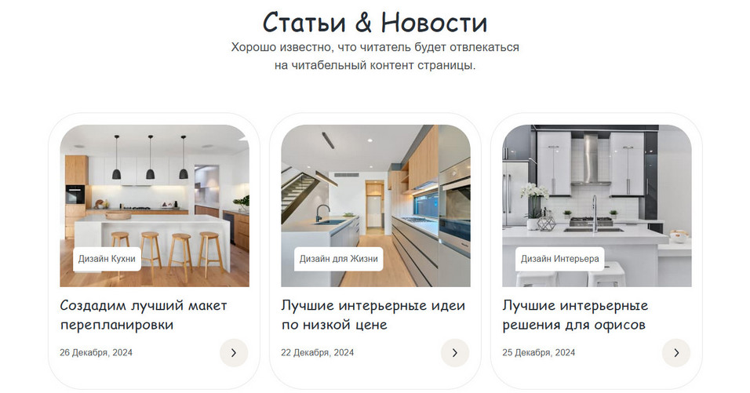

# Фреймворк Vue.js. Обучение в записи

# Урок 4. Семинар: Методы и работа с контентом
## Часть 1: Работа с макетом

Продолжаем создание макета: реализовать страницу Blog (Домашнее задание 2).<br>
Что мы можем заметить в проекте, что часть "Статьи & Новости" повторяется.<br> 
Как итог, вам необходимо создать блок “Статьи & Новости” с помощью Vue.js,<br> 
где данные для вёрстки будут храниться в массиве объектов<br> 
и выводить на страницу с помощью цикла v-for.

<br>

#### Задание по работе с макетом направлено на подготовку проекта к итоговой аттестации.

<br>
<br>

## Часть 2. Задание Vue

Вы разрабатываете приложение для отображения и сортировки списка товаров.<br> 
У вас есть массив объектов products,<br>
где каждый объект представляет товар с его названием и ценой.<br> 
Вам необходимо отобразить список товаров<br> 
и предоставить пользователю возможность сортировать товары по цене<br> 
(по возрастанию и по убыванию).
<br>
<br>



<br>

#### Формат сдачи: ссылка на гитхаб.

<br>
<br>

### Решение задания, часть 1
#### Создаем секцию ```<section class="blogs">``` с использованием Vue.js на страницу ```blog.html```

<br><br>

1. Подключаем Vue.js версии 2 на страницу с кодом html (через CDN)

```
<script src="https://cdn.jsdelivr.net/npm/vue@2"></script>
```

2. Создаем new Vue-инстанс в теге ```<script></script>```, который привязываем к элементу с id = app в первом теге после открывающегося тега <body> на странице.
3.  Для шаблонизации контента используем директиву v-for для создания в разметке html элементов vue.js на основе массива blogs.



4. Записываем все необходимые данные в данных Vue-инстанса, который содержит объекты с информацией о блогах, создаем массив blogs.
```
<script>
    new Vue({
        el: '#app',
        data: {
            blogs: [
                {
                    id: 1,
                    image: 'images/blog-1.jpg',
                    category: 'Дизайн Кухни',
                    title: 'Создадим лучший макет перепланировки',
                    date: '2021-11-23',
                    dateFormatted: '26 Декабря, 2024',
                    link: '#'
                },
                {
                    id: 2,
                    image: 'images/blog-2.jpg',
                    category: 'Дизайн для Жизни',
                    title: 'Лучшие интерьерные идеи по низкой цене',
                    date: '2021-11-23',
                    dateFormatted: '22 Декабря, 2024',
                    link: '#'
                },
                {
                    id: 3,
                    image: 'images/blog-3.jpg',
                    category: 'Дизайн Интерьера',
                    title: 'Лучшие интерьерные решения для офисов',
                    date: '2021-11-23',
                    dateFormatted: '25 Декабря, 2024',
                    link: '#'
                }
            ]
        }
    });
</script>
```

5. Каждый элемент массива создается как ```<div class="blogs__box">```. Данные выводятся в разметке в соответствии с расположенными в массиве элементами с уникальными записями для каждого конкретного блога в виде записи элемента массива в двойных фигурных скопках.

<br><br>



<br><br><br><br>